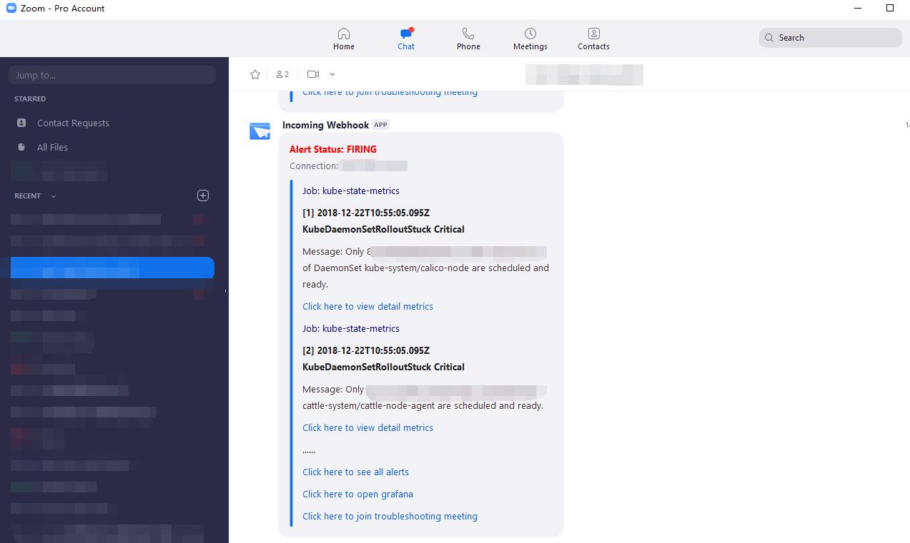
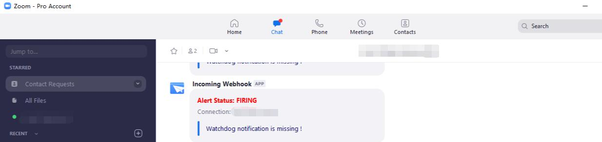
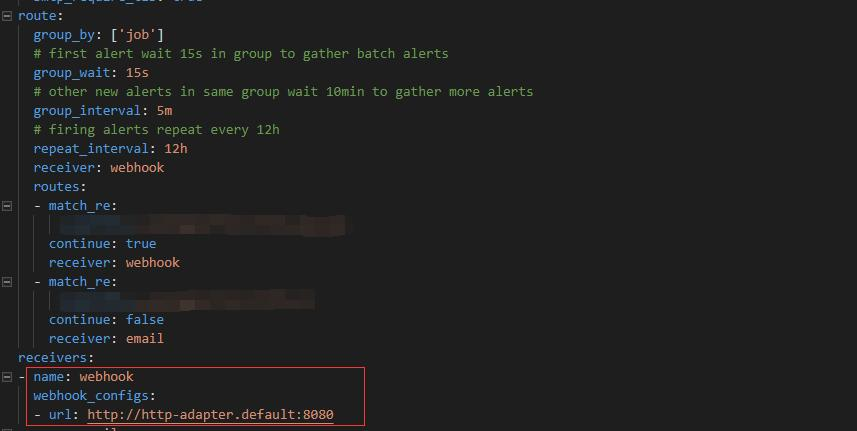

# Webhook Notification for ZOOM

Prometheus Alert Integration for ZOOM !

- ONE click to join troubleshooting meeting
- ONE click to open Grafana, Prometheus Graph, AlertManager 
- Beautiful and detailed alert information available for IM Group
- WatchDog/DeadMansSwitch Supported

> Alert Message Example



> WatchDog triggered if next notification been absent for 24h



# Quick Start

### Prerequisite: Setup your Prometheus with AlertManager
[Prometheus](https://prometheus.io/docs/prometheus/latest/installation/) is a CloudNative monitor & alert system with efficient TSDB, setup your Prometheus by binary file, or docker image, or Kubernetes Yaml, or  

[Prometheus-Operator](https://github.com/coreos/kube-prometheus), an awesome out of box deployment and management tool for Prometheus in Kubernetes

### Step1. Install Zoom Incoming Webhook

1. [Install Incoming Webhook App](https://marketplace.zoom.us/apps/eH_dLuquRd-VYcOsNGy-hQ)

2. Setup an incoming webhook chatbot: [Document](https://zoomappdocs.docs.stoplight.io/incoming-webhook-chatbot)

```bash
/inc connect your-alert-name

# Copy the "Endpoint"

# Copy the "Verification Token"
```

### Step2. Install Zoom IM Message Adapter

Apply following Yaml to Kubernetes cluster (kubectl apply -f zoom-alert-adapter.yaml), or start it just by docker.

> http-adapter is a light weight, configurable Node.js server based on Koa, with "PRELOAD_CONF" environment variable, it will download dynamic business logic (zoom-alert-2.0.zip here).

zoom-alert-adapter.yaml
```yaml
apiVersion: apps/v1
kind: Deployment
metadata:
  name: http-adapter-deployment
  namespace: default
  labels:
    app: http-adapter
spec:
  replicas: 1
  selector:
    matchLabels:
      app: http-adapter
  strategy:
    type: RollingUpdate
    rollingUpdate:
      maxUnavailable: 1
      maxSurge: 1
  minReadySeconds: 15
  revisionHistoryLimit: 5
  progressDeadlineSeconds: 180
  template:
    metadata:
      labels:
        app: http-adapter
    spec:
      containers:
      - name: http-adapter-container
        image: code2life/http-adapter:1.0.2
        imagePullPolicy: IfNotPresent
        env:
        - name: PORT
          value: "8080"
        - name: CONF_PATH
          value: /conf
        - name: SERVER_VERSION
          value: 1.0.9
        - name: DEBUG
          value: server:*
        - name: PRELOAD_CONF
          value: https://raw.githubusercontent.com/Code2Life/nodess-apps/master/dist/zoom-alert-2.0.zip
        - name: ZOOM_WEBHOOK
          value: <https://inbots.zoom.us/xxx - to replace>
        - name: ZOOM_TOKEN
          value: <to replace>
        - name: GRAFANA_URL
          value: <optional - add Grafana link to footer>
        - name: ZOOM_PMI
          value: <optional - add Zoom meeting link to footer>
        livenessProbe:
          tcpSocket:
            port: 8080
          initialDelaySeconds: 10
          timeoutSeconds: 5
          periodSeconds: 15
        ports:
        - containerPort: 8080
        resources:
          limits:
            cpu: "1"
            memory: 512Mi
          requests:
            cpu: 50m
            memory: 128Mi
        volumeMounts:
        - name: conf
          mountPath: /conf
      restartPolicy: Always
      dnsPolicy: ClusterFirst
      volumes: 
      - name: conf
        emptyDir: {}
---
apiVersion: v1
kind: Service
metadata:
  name: http-adapter
  namespace: default
spec:
  type: ClusterIP
  ports:
  - port: 8080
    targetPort: 8080
  selector:
    app: http-adapter
```

By Docker:

> docker run -d --restart always -e PORT=8080 -e SERVER_VERSION=1.0.9 -e DEBUG=server:* \
 -e ZOOM_WEBHOOK=xxxx -e ZOOM_TOKEN=xxx -e GRAFANA_URL=xxx -e ZOOM_PMI=xxx\
 -e PRELOAD_CONF=https://raw.githubusercontent.com/Code2Life/nodess-apps/master/dist/zoom-alert-2.0.zip
 code2life/http-adapter:1.0.2

Some environment variables to replace in Kubernetes Yaml/Docker
- ZOOM_WEBHOOK: Endpoint provided by Zoom Incoming Webhook
- ZOOM_TOKEN: Verification Token provided by Zoom Incoming Webhook
- GRAFANA_URL: Your Grafana URL, optional
- ZOOM_PMI: Your Personal Meeting ID, optional

### Step3. Configure your AlertManager

1. Add webhook receiver with URL (http://http-adapter.default:8080), or other URL corresponding to your deployment
2. Add alert route to the receiver



### Step4. Test your alert pipeline by alertmanager API

```bash
curl -X POST http://your.alertmanager:9093/api/v1/alerts \
  -H 'Content-Type: application/json' \
  -d '[{
"labels": {
"alertname": "test_alert",
"service": "my-service",
"severity": "critical",
"instance": "10.10.10.10"
},
"annotations": {
  "summary": "Test service is down!"
},
"generatorURL": "http://prometheus.cluster/graph"
}]'
```